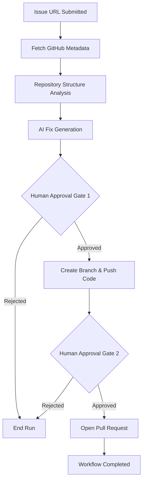

# 🔮 MergeMind: AI-Powered Bug-to-PR Autopilot

<div align="center">

[](https://github.com/ravikiranreddybada/MergeMind)
[](https://opensource.org/licenses/MIT)
[](https://fastapi.tiangolo.com/)
[](https://nextjs.org/)
[](https://groq.com/)

**Transforming GitHub issues into production-ready pull requests with intelligent AI orchestration.**

[Live Demo](https://merge-mind-eight.vercel.app) • [API Documentation](https://mergemind-01id.onrender.com/docs) • [Watch Demo](https://www.loom.com/share/6635a391d1dd4614813f015d38c44c26)

</div>

---

## 🚀 The Vision

**The Problem:** Developers spend hours triaging bugs, setting up local environments, and manually crafting boilerplate fixes for repetitive issues.  
**The Solution:** **MergeMind** automates the entire lifecycle—from issue parsing to code generation and PR creation—allowing developers to focus on high-level architecture while AI handles the execution.

---

## 🔗 Live Demo & Preview

| Resource | Link |
| :--- | :--- |
| **🌐 Frontend Dashboard** | [merge-mind-eight.vercel.app](https://merge-mind-eight.vercel.app) |
| **⚙️ Backend API** | [mergemind-01id.onrender.com](https://mergemind-01id.onrender.com) |
| **🎥 Video Walkthrough** | [Loom Demo Video](https://www.loom.com/share/6635a391d1dd4614813f015d38c44c26) |


---

## 🛠 Tech Stack

### **Frontend**
- **Framework:** Next.js 14 (App Router)
- **Language:** TypeScript
- **Styling:** Tailwind CSS + Heroicons
- **State/Fetching:** SWR + Server-Sent Events (SSE)

### **Backend**
- **Framework:** FastAPI (Python 3.9+)
- **Async Logic:** Asyncio for non-blocking I/O
- **Validation:** Pydantic v2
- **Server:** Uvicorn

### **AI & Integration**
- **LLM:** Groq Llama-3.1-70b (Ultra-fast inference)
- **API:** GitHub REST API v3
- **Orchestration:** Custom Workflow State Machine

---

## ✨ Key Features

- **🎯 Context-Aware Analysis:** Deep-scans your repository structure to understand patterns before proposing a fix.
- **🛡️ Human-in-the-Loop:** Two-stage manual approval gates ensure code quality and security before any PR is opened.
- **⚡ Real-Time Progress:** Live workflow updates via SSE (Server-Sent Events) for a seamless "autopilot" experience.
- **🧪 Demo Mode:** Explore the full workflow without API keys using simulated GitHub operations.
- **🌑 Premium UI:** Sleek, responsive dashboard with native dark mode support.

---

## 🏗 Architecture & Workflow

MergeMind operates on a state-machine based workflow that ensures reliability and observability at every step.



### **The Step-by-Step Flow:**
1. **Fetch Issue:** Parses the URL to retrieve problem statements.
2. **Analyze Repo:** Identifies tech stack, file hierarchy, and coding standards.
3. **Propose Fix:** AI generates precise code changes relative to the repo's context.
4. **Manual Review:** Users inspect the AI's proposal.
5. **PR Creation:** Automates branching, committing, and opening the PR on GitHub.

---

## 💻 Installation & Setup

Get up and running in less than 2 minutes.

### **Quick Start (One Command)**
We've included a specialized script to handle everything for you:
```bash
python install_and_run.py
```
*This command creates a virtual environment, installs dependencies for both frontend and backend, and starts the development servers.*

### **Manual Setup**
1. **Clone the Repo:**
   ```bash
   git clone https://github.com/ravikiranreddybada/MergeMind.git
   cd MergeMind
   ```
2. **Backend Setup:**
   ```bash
   cd backend
   pip install -r requirements.txt
   uvicorn main:app --reload
   ```
3. **Frontend Setup:**
   ```bash
   cd frontend
   npm install
   npm run dev
   ```

---

## ⚙️ Configuration

Create a `.env` file in the root directory:

```bash
# Required for real GitHub operations
GITHUB_TOKEN=ghp_your_personal_access_token

# Required for AI logic
GROQ_API_KEY=gsk_your_groq_api_key
```

---

## 📂 Project Structure

```text
MergeMind/
├── backend/
│   ├── main.py             # FastAPI entry point
│   └── services/
│       ├── runs.py         # Workflow state machine
│       ├── github.py       # GitHub API wrapper
│       ├── ai_fix_generator.py # Groq LLM integration
│       └── repo_analyzer.py # File structure logic
├── frontend/
│   ├── app/                # Next.js App Router
│   ├── components/         # Reusable UI components
│   └── public/             # Static assets
├── config/
│   └── config.yaml         # Repository allowlist
└── install_and_run.py      # Automated setup script
```

---

## 🔮 Future Improvements

- [ ] **Multi-Model Support:** Integration with GPT-4 and Claude 3.5 Sonnet.
- [ ] **Automated Testing:** Run `pytest` or `jest` inside the sandbox before proposing fixes.
- [ ] **Diff Visualization:** Interactive code diff viewer in the dashboard.
- [ ] **Slack/Discord Notifications:** Webhook alerts for PR approvals.

---

## 🤝 Contributing

Contributions make the open-source community an amazing place to learn, inspire, and create. Any contributions you make are **greatly appreciated**.

1. Fork the Project
2. Create your Feature Branch (`git checkout -b feature/AmazingFeature`)
3. Commit your Changes (`git commit -m 'Add some AmazingFeature'`)
4. Push to the Branch (`git push origin feature/AmazingFeature`)
5. Open a Pull Request

---

## 📄 License

Distributed under the MIT License. See `LICENSE` for more information.

---

## 👤 Author

**Ravikiran Reddy Bada**  
- GitHub: [@ravikiranreddybada](https://github.com/ravikiranreddybada)  
- LinkedIn: [Ravikiran Reddy](https://linkedin.com/in/ravikiranreddybada)

---

<div align="center">
  Built with ❤️ for the Developer Community
</div>
