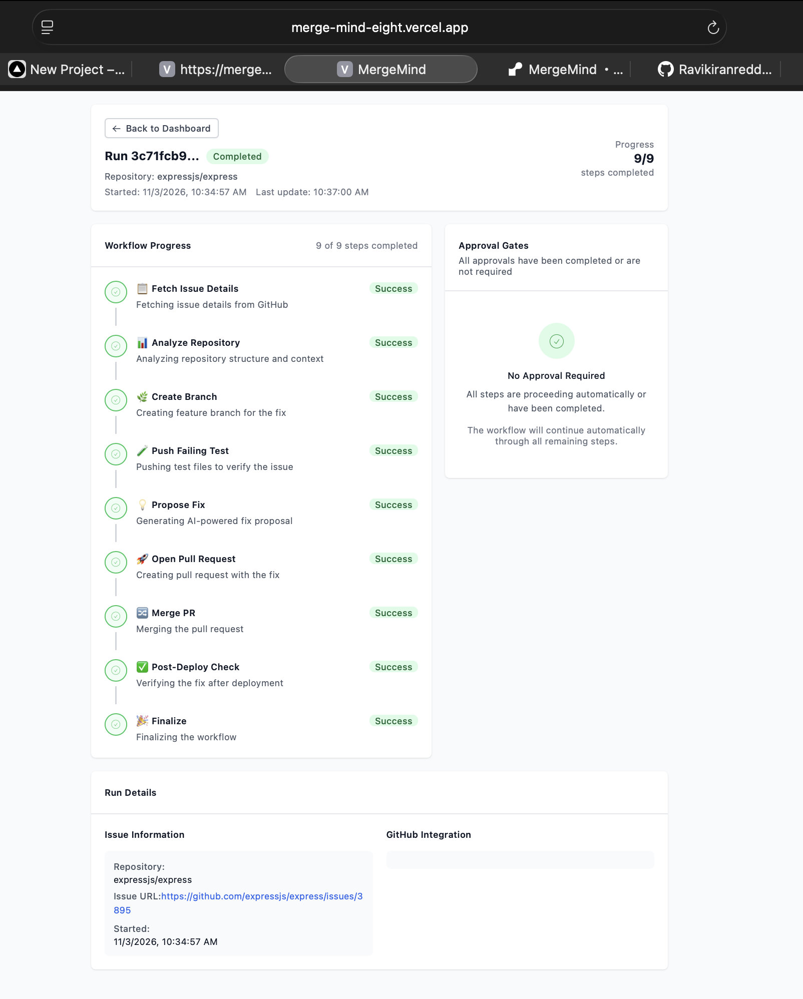

# 🔮 MergeMind

**Live Demo → [merge-mind-eight.vercel.app](https://merge-mind-eight.vercel.app)**  
**API → [mergemind-01id.onrender.com](https://mergemind-01id.onrender.com)**  
**Demo Video → [Watch on Loom](https://www.loom.com/share/6635a391d1dd4614813f015d38c44c26)**



**MergeMind** turns GitHub issues into pull requests automatically

Built with **FastAPI**, **Next.js 14**, and **Groq AI**.

---

## What It Does

1. You paste a GitHub issue URL into the dashboard
2. The AI analyzes the issue and the repository structure
3. It generates a code fix and opens a branch
4. You review and approve (or reject) the proposed fix
5. It creates a real pull request on GitHub

---

## Tech Stack

| Layer | Technologies |
|---|---|
| Frontend | Next.js 14, TypeScript, Tailwind CSS |
| Backend | FastAPI, Python 3.9+ |
| AI | Groq LLM (llama-3.1-70b-versatile) |
| Integration | GitHub REST API |

---

## Quick Start

### 1. Clone and install

```bash
python install_and_run.py
```

This installs all Python and Node.js dependencies, sets up the environment, and starts both servers.

### 2. Add your API keys

```bash
# Edit the .env file
GITHUB_TOKEN=ghp_your_token_here
GROQ_API_KEY=your_groq_api_key_here
```

> **No keys?** The app runs in demo mode — all GitHub operations are simulated so you can still explore the full workflow.

### 3. Open the app

- Frontend: http://localhost:3000  
- API: http://localhost:8000

---

## Project Structure

```
MergeMind/
├── backend/
│   ├── main.py                  # FastAPI app + API routes
│   └── services/
│       ├── runs.py              # Workflow state machine
│       ├── github.py            # GitHub API integration
│       ├── ai_fix_generator.py  # Groq-powered fix generation
│       └── repo_analyzer.py     # Repository structure analysis
├── frontend/
│   └── app/
│       ├── page.tsx             # Landing page
│       ├── dashboard/           # Run management dashboard
│       └── runs/[id]/           # Live run detail view
├── config/
│   └── config.yaml              # Repository allowlist
└── install_and_run.py           # One-command setup
```

---

## Key Features

- **Human-in-the-loop approval** — two manual gates before any code is merged
- **Demo mode** — works without real API keys for exploration
- **Real-time updates** — live workflow progress via Server-Sent Events (SSE)
- **Dark mode** — full light/dark theme support

---

## API Endpoints

```
POST   /runs              Create a new run
GET    /runs              List all runs
GET    /runs/{id}         Get run details
POST   /runs/{id}/approve Approve or reject a gate
GET    /runs/{id}/events  Live SSE stream of events
GET    /health            Service health check
```

---

## Running Tests

```bash
python -m pytest tests/
```

---

## Environment Variables

| Variable | Required | Description |
|---|---|---|
| `GITHUB_TOKEN` | Yes (for real PRs) | GitHub personal access token |
| `GROQ_API_KEY` | Yes (for AI fixes) | Groq API key |

---

